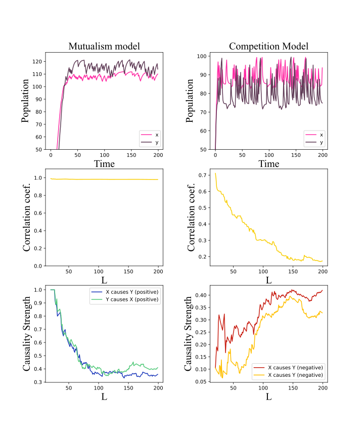

Though the algorithm in Appendix is confusing, I try to fix them and repeat the model test in the article. But the result (shown in the following figure) is fallacious and far from the result shown in article Fig.2 . My algorithm, data, and code are as follows. anyone can check and repeat them.

## Algoritm

All unspecified symbols use their meanings in the original text.

Calculate $P_{y(t)}$ (or $P_{x(t)}$):

$$
\begin{equation}
P_{y(t)} = \mathit{signature}(S_{y(t)}),\ \ S_{y(t)} \in \mathbb R^{E-1},
\end{equation}
$$
where,  
$$
\begin{equation}
S_{y(t)} = \sum_{j}w_j^ys_j^y,\ \ w_j^y\in[0,1], s_j^y\in \mathbb R^{E-1}, j \in \lbrace t_{y_1}, t_{y_2}, \cdots, t_{y_{E+1}}\rbrace,
\end{equation}
$$

Notice, $t_{y_1}, t_{y_2}, \cdots, t_{y_{E+1}}$ is indexes of E+1 nearest neighbors of $y(t_y)$.

$$
\begin{equation}
w_j^y = \frac{e^{-\mathit{d_p}(y(t), y(t_j))}}{\sum_1^{E+1}e^{-\mathit{d_p}(y(t), y(t_{y_i}))}},\ \  \mathit{d}_p: \mathit{L_p\ distance}.
\end{equation}
$$

$$
\begin{equation}
s_j^y = \left(\frac{y_j^{(2)} - y_j^{(1)}}{y_j^{(1)}}, \cdots, \frac{y_j^{(E)} - y_j^{(E-1)}}{y_j^{(E-1)}}\right), \ \ y_i \in \mathbb R,
\end{equation}
$$

$$
\begin{equation}
y(t_j) = \left(Y(t_j), Y(t_j+\tau), \cdots, Y(t_j + (E - 1)\tau)\right) = \left(y_j^{(1)}, y_j^{(2)}, \cdots, y_j^{(E)}\right), \ \ Y\in\mathbb R,
\end{equation}
$$

Estimate $\widehat{P_{x(t)}}$:

$$
\begin{equation}
\widehat{P_{x(t)}} = \mathit{signature}(\widehat{S_{x(t)}}),\ \ \widehat{S_{x(t)}} \in \mathbb R^{E-1},
\end{equation}
$$

where,

$$
\begin{equation}
\widehat{S_{x(t)}} = \sum_jw_j^ys_j^{\hat x},\ \ w_j^y\in[0,1], s_j^{\hat x}\in \mathbb R^{E-1}, j \in \lbrace t_{y_1}, t_{y_2}, \cdots, t_{y_{E+1}}\rbrace,
\end{equation}
$$

$$
\begin{equation}
s_j^{\hat x} = \left(\frac{\hat x_j^{(2)} - \hat x_j^{(1)}}{\hat x_j^{(1)}}, \cdots, \frac{\hat x_j^{(E)} - \hat x_j^{(E-1)}}{\hat x_j^{(E-1)}}\right), \ \ \hat x_j \in \mathbb R,
\end{equation}
$$

$$
\begin{equation}
\widehat{x(t_j)} = \left(X(t_j), X(t_j+\tau), \cdots, X(t_j + (E - 1)\tau)\right) = \left(\hat x_j^{(1)}, \hat x_j^{(2)}, \cdots, \hat x_j^{(E)}\right), \ \ X\in\mathbb R,
\end{equation}
$$

Fill pattern matrix **using accuracy**:
$$
\begin{equation}
PC[P_X, P_Y] = \frac1L\sum_1^LI(P_{x(t)}=\widehat{P_{x(t)}}),
\end{equation}
$$

where,

$$
\begin{equation}
I(P_{x(t)}=\widehat{P_{x(t)}})=
\begin{cases}
1, & P_{y(t)}=\widehat{P_{x(t)}} \\\\
0, & \text{otherwise}
\end{cases}
\end{equation}
$$

Determine causality:

$$
\begin{equation}
\mathit{PC(Positive)} = \sum diag_{main}(PC)
\end{equation}
$$

$$
\begin{equation}
\mathit{PC(Negative)} = \sum diag_{counter}(PC)
\end{equation}
$$

$$
\begin{equation}
\mathit{PC(Positive)} = \sum PC \notin (diag_{main}(PC) \cup diag_{counter}(PC))
\end{equation}
$$

## Code

Please check the file pc.py in code.zip. And model test code is 'test/test.ipynb' in code.zip

