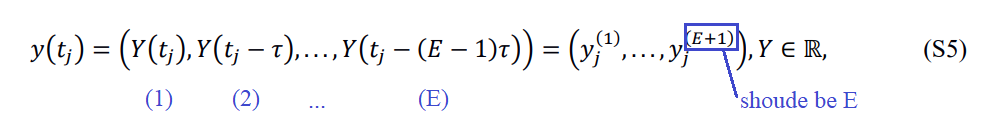
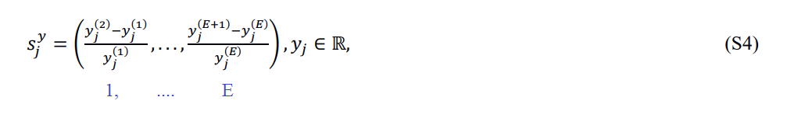
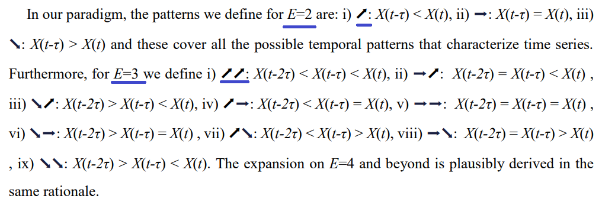
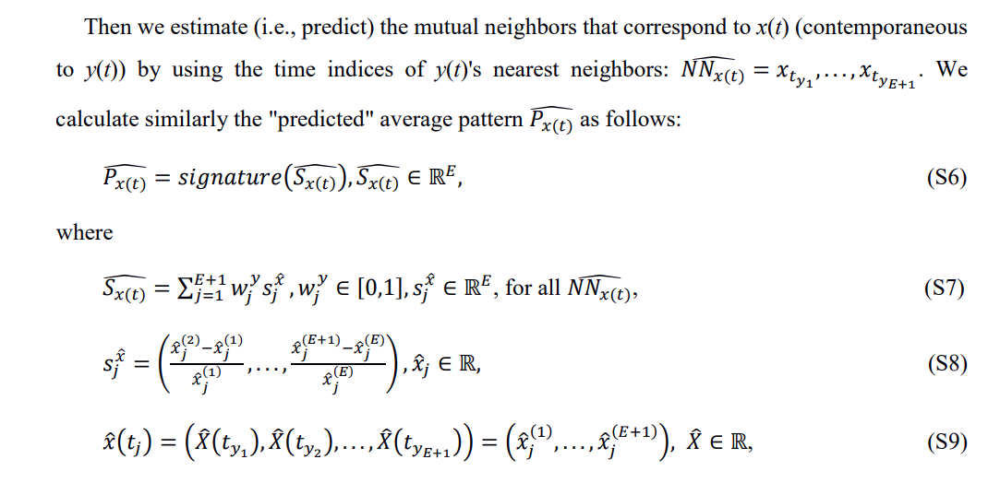
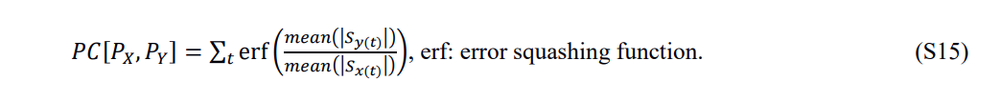

In this PDF, I will list some errors that occur in the article or appendix. Some errors look insignificant. But for mathematical formulas, any tiny error may confuse. Anyway, these errors make the algorithm hard to be implemented for the reader.

1. In S1 Appendix S5, the tuple of the vector does not correspond:  
    

2. Due to the error of S5, in S4, $s_j^y$ becomes an E-tuple vector.  
      
    But accroding to defination in p4 S1 Appendix, $s$ should be an E-1 tuple vector:
      
    In fact, we can't get the Est element in $s_j^y$ (S4) because $y_j^{(E+1)}$ actually does not exist (S5).  
3. In S1 Appendix S6-S9:
    
    if the author doesn't wrong, S9 is not a counterpart of S5. Thus $\hat x(t_j)$ is an (E+1)-tuple vector with no problem. And $s_j^{\hat x}$ in S8 is an E-tuple vector. S7 calculates the weighted average of the pattern for all $\widehat{NN_{x(t)}}$, but according to S8 and S9 there is only one $s_j^{\hat x}$ or all $s_j^{\hat x}$ is equaled. S7 is meaningless.  
    even if we ignore the problem above, $\hat S_{x(t)}$ is an $E$-tuple vector, but $S_{x(t)}$ calculate from S2-S5 is an $E-1$-tuple vector according to points 1 and 2. tuple of $\hat S_{x(t)}$ and $S_{x(t)}$ is even not equaled. how to "predict"?  

4. In the article and appendix, the author mentions a principle more than once, like "The strength of causality is determined by the overall **accuracy** percentage between the estimated $\hat P_x(t)$ and the actual $P_{x(t)}$". But in the actual calculations, it seems don't base on 'accuracy' (S15):  
      

In conclusion, according to the information from the article and related appendix readers can't implement the algorithm which constitutes the key content of the paper. Thus the validity of the method and the authenticity of the result can't be verified.

